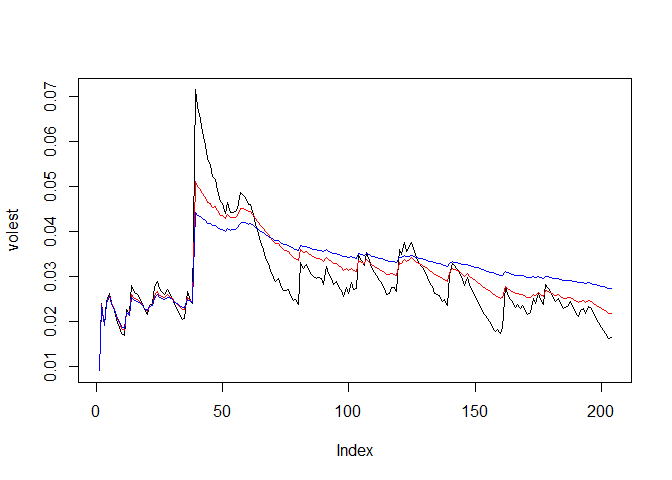

For this analysis, we need to install/load the tseries R Package.

    ##install.packages("tseries")
    library(tseries)

I have chosen to analyze the Company I work for, AmerisourceBergen.
Ticker Symbol "ABC"

Step 1: Load the closing quotes

    tickerdata<-get.hist.quote('ABC', quote="Close")

    ## Warning in download.file(url, destfile, method = method, quiet = quiet):
    ## downloaded length 336342 != reported length 200

    ## time series starts 1995-04-04
    ## time series ends   2016-07-08

    head(tickerdata)

    ##               Close
    ## 1995-04-04 23.62496
    ## 1995-04-05 22.75000
    ## 1995-04-06 23.12496
    ## 1995-04-07 22.75000
    ## 1995-04-10 23.00000
    ## 1995-04-11 22.87504

Step 2: Compute the Log Returns

    tickerLogReturn<-log(lag(tickerdata))-log(tickerdata)
    head(tickerLogReturn)

    ##                   Close
    ## 1995-04-04 -0.037738635
    ## 1995-04-05  0.016347408
    ## 1995-04-06 -0.016347408
    ## 1995-04-07  0.010929071
    ## 1995-04-10 -0.005447856
    ## 1995-04-11  0.000000000

Step3: Compute Volatility

    TickerVolatility<- sd(tickerLogReturn) * sqrt(250) * 100
    TickerVolatility

    ## [1] 42.34852

    Vol <- function(d,logrets) {
      var = 0
      lam = 0
      varlist <- c()
      for (r in logrets) {
        lam = lam * (1-1/d) + 1
      var = (1-1/lam)*var + (1/lam) * r^2
        varlist <- c(varlist, var)
        
      }
      sqrt(varlist)
    }

    volest  <- Vol(10,tickerLogReturn)
    head(volest)

    ## [1] 0.03773863 0.02855301 0.02475979 0.02166832 0.01902920 0.01687687

    volest2 <- Vol(30,tickerLogReturn)
    head(volest2)

    ## [1] 0.03773863 0.02891222 0.02529615 0.02242974 0.02004705 0.01814115

    volest3 <- Vol(100,tickerLogReturn)
    head(volest3)

    ## [1] 0.03773863 0.02903126 0.02547595 0.02268538 0.02038818 0.01856464

Step 4: Plot Volatility

    plot(volest,type="l")
    lines(volest2, type="l", col="red")
    lines(volest3, type="l", col="blue")

<!-- -->
